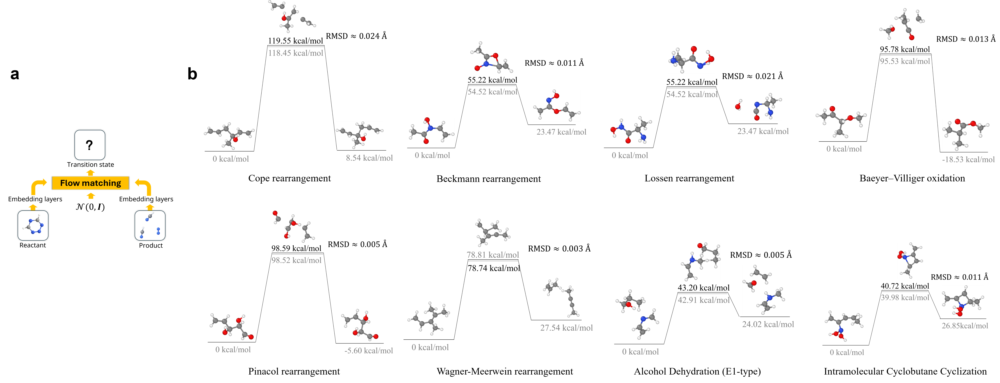

# TS-GEN

Implementation of [Accurate generation of chemical reaction transition states by conditional flow matching](https://arxiv.org/abs/2507.10530) by Ping Tuo*, Jiale Chen, Ju Li*.

We introduce ODE-based generative modeling for transition states of chemical reactions. The model achieve a root-mean-square deviation of 0.004 Å in saddle point configurations, while requiring only $0.06$ second GPU time per inference. We used classifier-free guidance by the reactant and product configurations to intentionally train mode collapse towards the target transition state in the ODE model, which ensured accuracy and robustness. The model is validated on chemical reactions out of the training set, demonstrating generalizability. Methodological details and further evaluations can be found in the paper. Please feel free to reach out to us at tuoping@berkeley.edu, liju@mit.edu with any questions.




## Installation

```
pip install numpy==1.26.0 pandas==1.5.3 scikit-learn==1.6.1
pip install torch==2.6.0 -f https://download.pytorch.org/whl/torch_stable.html
pip install torch_geometric
pip install pytorch_lightning==2.0.4 mdtraj==1.9.9 biopython==1.79
pip install wandb dm-tree einops torchdiffeq fair-esm pyEMMA
pip install matplotlib==3.7.2
pip install omegaconf==2.3.0
pip install ase==3.22 pymatgen
# before installing torch_scatter, make sure the libstdc++.so.6 include GLIBCXX_3.4.32 by `strings .../libstdc++.so.6.0.33 | grep GLIB`
pip install torch_scatter
```

## Datasets

1. Download the Transition1x datasets:
```
git clone https://gitlab.com/matschreiner/Transition1x
cd Transition1x
pip install .
```
2. Preprocess the Transition1x datasets by `./scripts/Transition1x/prep_data.ipynb`
3. Download the [RGD1](https://github.com/zhaoqy1996/RGD1) database here: https://figshare.com/articles/dataset/model_reaction_database/21066901
4. Preprocess the RGD1 datasets by `./scripts/RGD1/prep_data.ipynb`

## Training

Commands similar to these were used to train the models presented in the paper.
```
python train-Transition1x-equivariant.py --tps_condition --data_dir data/Transition1x  --ckpt_freq 10  --epochs 500 --run_name [name] --cutoff 12 

```

## Model weights

The model weights used in the paper may be downloaded here:
```
wget https://drive.google.com/file/d/1V_5jwi0hHoy-E7eLeUcmHIOGHWzGSxXf/view?usp=drive_link
```


## Inference

Inference by `notebooks/Transition1x-checkgraph-inference.ipynb`

## Analysis

Error against reference by `scripts/calculate_err.ipynb`, where we use [MACE-OFF](https://github.com/ACEsuit/mace-off) model to evaluate the energies of the generated and reference configurations.

## *To be Noted*

- Periodic boundary condition need to be specifically turned on by `--pbc`.
- When "--pbc" is enforced, the condition embedding for '--tps_condition' or '--sim_condition' is also read periodically, and the node features instead of the raw coordinates are embedded as input conditions.

## License

MIT. Additional licenses may apply for third-party source code noted in file headers.

## Citation
```
@misc{tuo2025accurate,
  title        = {Accurate generation of chemical reaction transition states by conditional flow matching},
  author       = {Tuo, Ping and Chen, Jiale and Li, Ju},
  year         = {2025},
  eprint       = {2507.10530},
  archivePrefix= {arXiv},
  primaryClass = {physics.chem-ph},
  doi          = {10.48550/arXiv.2507.10530},
  url          = {https://arxiv.org/abs/2507.10530}
}
```

## Acknowledgements

Code developed based on

[Generative Modeling of Molecular Dynamics Trajectories](https://github.com/bjing2016/mdgen)
